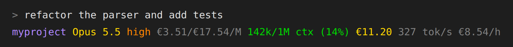

# tachobar

A fast, cross-platform status line for [Claude Code](https://code.claude.com)
that shows **what your session really costs**, in your own currency.

[](https://buymeacoffee.com/DrFritzi)



```
myproject Opus 5.5 high €3.51/€17.54/M 142k/1M ctx (14%) €11.20 327 tok/s €8.54/h
│         │        │    │              │                  │      └ burn rate over the last hour
│         │        │    │              │                  └ session cost incl. subagents
│         │        │    │              └ context window usage
│         │        │    └ input/output price per 1M tokens
│         │        └ reasoning effort
│         └ model (colored by price tier)
└ directory
```

## Why tachobar

- **Correct costs.** Every cache bucket is priced separately (5-minute and
  1-hour cache writes, cache reads), long-context (>200k) rates apply where a
  model has them, and **subagent spend is included**. Claude Code's own
  session total leaves subagents out.
- **Any currency.** ECB reference rates, refreshed daily. `€`, `£`, `CHF`,
  `¥`, `kr` and more, each with its usual symbol placement.
- **Honest.** An unknown model shows `?`, and stale prices or exchange rates
  get a warning in the line. Nothing is silently guessed.
- **One static binary** for Windows, macOS and Linux (x64 and arm64). No
  runtime, no `jq`. A render takes a few milliseconds.

## Install

### As a Claude Code plugin

```
/plugin marketplace add DrFritzi/tachobar
/plugin install tachobar@tachobar
/tachobar:setup EUR
```

Plugins cannot set the status line directly, so `/tachobar:setup` installs
the binary and writes the `statusLine` setting for you. The optional argument
sets the currency.

### Manually

**macOS / Linux**

```sh
curl --proto '=https' --tlsv1.2 -LsSf https://github.com/DrFritzi/tachobar/releases/latest/download/tachobar-installer.sh | sh
tachobar --init --write
```

**Windows (PowerShell)**

Download the release zip, check it and unpack it. No script is executed, and
nothing but `tachobar.exe` is installed:

```powershell
$arch = if ($env:PROCESSOR_ARCHITECTURE -eq 'ARM64') { 'aarch64' } else { 'x86_64' }
$name = "tachobar-$arch-pc-windows-msvc.zip"
$url  = "https://github.com/DrFritzi/tachobar/releases/latest/download/$name"
$zip  = "$env:TEMP\$name"
$dir  = "$env:LOCALAPPDATA\Programs\tachobar"
Invoke-WebRequest $url -OutFile $zip -UseBasicParsing
# Optional: compare against the published checksum
Invoke-WebRequest "$url.sha256" -OutFile "$zip.sha256" -UseBasicParsing
$want = (Get-Content "$zip.sha256" -Raw).Split(' ')[0]
if ((Get-FileHash $zip -Algorithm SHA256).Hash -ne $want) { throw "checksum mismatch" }
Expand-Archive $zip -DestinationPath $dir -Force
& "$dir\tachobar.exe" --init --write
```

`--init --write` points Claude Code at the full path of `tachobar.exe`, so
it doesn't need to be on your `PATH`. To run `tachobar` by name in a
terminal, add `%LOCALAPPDATA%\Programs\tachobar` to your `PATH`.

There is also a script installer (`tachobar-installer.ps1` on the release
page). Microsoft Defender blocks the usual one-line form
(`irm … | iex` with `-ExecutionPolicy Bypass`) as a suspicious command
pattern, whatever the script contains, so the zip is the recommended route.

**From source** (any platform, needs a Rust toolchain)

```sh
cargo install --git https://github.com/DrFritzi/tachobar --locked
tachobar --init --write
```

Prebuilt archives for every platform are also on the
[releases page](https://github.com/DrFritzi/tachobar/releases).

`tachobar --init` prints the snippet for `~/.claude/settings.json`.
`--init --write` adds it for you, keeps every other setting, and saves the
old file as `settings.json.bak`:

```json
{
  "statusLine": {
    "type": "command",
    "command": "/home/you/.cargo/bin/tachobar",
    "padding": 0
  }
}
```

## Configuration

Run `tachobar config --write` to create the config file with every option
commented, and `tachobar doctor` to see where it lives:

| OS      | Config file                                          |
| ------- | ---------------------------------------------------- |
| Linux   | `~/.config/tachobar/config.toml`                     |
| macOS   | `~/Library/Application Support/tachobar/config.toml` |
| Windows | `%APPDATA%\tachobar\config.toml`                     |

```toml
currency = "EUR"                 # any ISO 4217 code with an ECB rate, default "USD"

# Formatting overrides (defaults depend on the currency)
# decimals = 2
# symbol = "€"
# symbol_position = "after"      # "before" or "after"
# decimal_separator = ","

# Which segments to show, in order
segments = ["dir", "model", "effort", "price", "context", "cost", "burn"]

no_color = false                 # NO_COLOR in the environment also works
auto_refresh = true              # daily background download of prices and rates

[thresholds]
price_per_mtok = [10.0, 25.0, 50.0]  # output USD/1M where the model turns yellow/orange/red
context_pct = [50.0, 80.0, 95.0]     # context % where it turns yellow/orange/red
stale_days = 7                       # warn when prices or rates are older than this
```

| Segment   | Shows                                                                                          |
| --------- | ---------------------------------------------------------------------------------------------- |
| `dir`     | Name of the current directory                                                                  |
| `model`   | Model display name, colored by its output price                                                |
| `effort`  | Reasoning effort, from Claude Code, then `CLAUDE_EFFORT_LEVEL`, then `effortLevel` in settings |
| `price`   | Input/output list price per 1M tokens                                                          |
| `context` | Tokens in context / window size, and the percentage                                            |
| `cost`    | Session cost including subagents; a trailing `+` means part of it could not be priced          |
| `burn`    | Tokens per second and cost per hour over the last hour (needs at least a minute of data)       |

Warnings appear in brackets at the end, e.g. `[unpriced model claude-x]`,
`[prices 12d old]`, `[no XYZ rate, showing USD]`.

### Commands

```
tachobar                  render (reads Claude Code's JSON on stdin)
tachobar --init [--write] print / install the statusLine setting
tachobar config [--write] print / create the config file
tachobar refresh          download prices and exchange rates now
tachobar doctor           show data sources, their age and file locations
```

Environment: `NO_COLOR`, `COLUMNS` (set by Claude Code, used for wrapping),
`TACHOBAR_CONFIG`, `TACHOBAR_CACHE_DIR`, `TACHOBAR_STATE_DIR`,
`TACHOBAR_NO_REFRESH`.

## How costs are calculated

**Session cost = Claude Code's `cost.total_cost_usd` + the priced subagent
transcripts.**

1. **Main conversation.** tachobar uses `cost.total_cost_usd` from the JSON
   Claude Code sends to the status line. Claude Code computes it at list price
   (or from your `modelPricing` setting).
2. **Subagents.** Claude Code does not include subagent (Task tool) spend in
   that figure. tachobar reads every
   `<session>/subagents/agent-*.jsonl` next to the session transcript and
   prices each API response with **the model that response used**, so a Haiku
   subagent is billed as Haiku even when the main loop runs Opus.
3. **Per response,** in USD per token from litellm's
   [`model_prices_and_context_window.json`](https://github.com/BerriAI/litellm/blob/main/model_prices_and_context_window.json):

   ```
     input_tokens                 × input_cost_per_token
   + output_tokens                × output_cost_per_token
   + cache_creation.ephemeral_5m  × cache_creation_input_token_cost
   + cache_creation.ephemeral_1h  × cache_creation_input_token_cost_above_1hr
   + cache_read_input_tokens      × cache_read_input_token_cost
   + web_search_requests          × search_context_cost_per_query
   ```

   If a request's prompt (input + cache reads + cache writes) is over 200k
   tokens and the model has `*_above_200k_tokens` prices, those rates apply to
   the whole request. If litellm lacks a cache price for a model, tachobar
   uses Anthropic's published multipliers (1.25× input for 5-minute writes,
   2× for 1-hour writes, 0.1× for reads).
4. **Request modifiers**, read from each response's `usage`:
   - **Fast mode** (`speed: "fast"`): the model's fast-mode input/output
     prices from Anthropic's [pricing page](https://platform.claude.com/docs/en/about-claude/pricing#fast-mode-pricing)
     (litellm does not carry them). Cache writes and reads scale with the
     fast input price, and fast mode has one price across the whole context
     window.
   - **US-only inference** (`inference_geo: "us"`): the data residency
     multiplier (currently 1.1×) on every token category.
   - **Batch** (`service_tier: "batch"`): 50% off every token category.

   Fast-mode prices and the data residency multiplier are re-read from the
   pricing page on each daily refresh. The parser is strict: if the page
   layout changes, the last good values stay in use, and `tachobar refresh`
   says so.
5. **Deduplication.** Claude Code writes one transcript line per content
   block (thinking, text, tool call), and each line repeats the same usage.
   Lines are deduplicated by `message.id` + `requestId`, so each API response
   is counted once.
6. **Caching.** A finished subagent transcript never changes, so its cost is
   cached by file size and modification time and parsed only once.
7. **Currency.** USD amounts are converted with the latest ECB reference
   rate from [frankfurter.app](https://frankfurter.app).

**Validation.** On a real session, the formula reproduces Claude Code's own
`costUSD` exactly: 8 input + 682 output + 231,276 cache-read +
22,241 one-hour cache-write tokens on Opus 5.5 = $0.2378552. Pricing those
1-hour writes at the 5-minute rate would give $0.171, which is 28% too low.

### Limits

- It is an **estimate at list price**, not your invoice. Negotiated
  discounts and subscription plans (Pro/Max) are not reflected. On a
  subscription, the number is what the usage *would* cost at API prices.
- A trailing **`+`** on the cost means the true cost is higher than shown,
  and a note in the line says why:
  - `[N subagent calls unpriced]`: a model litellm does not know yet, fast
    mode on a model without a published fast price, or a `speed` value
    tachobar does not know. These calls are left out of the total.
  - `[N subagent calls estimated]`: priced, but only as a lower bound or
    list-price estimate. This covers cache writes logged without the
    5-minute/1-hour split (priced at the cheaper 5-minute rate), Priority
    Tier (billed through a capacity commitment, so list price is only an
    estimate), and unknown `inference_geo` / `service_tier` values.
- A model litellm does not know shows `?` for its price.
- Exchange rates are ECB daily reference rates, not your card's rate.
- The tokens/s figure counts all tokens processed (input, cache reads and
  writes, output) by the main conversation and subagents.

## Data and privacy

tachobar reads transcripts only for token counts and model ids. Its only
network traffic is a daily set of HTTPS GETs: GitHub (litellm pricing),
platform.claude.com (Anthropic's pricing page, for fast-mode and data residency
prices) and frankfurter.app (exchange rates). A background process makes them
and never delays rendering. All data ships bundled in the binary, so tachobar
works offline from the first run. There is no telemetry. See [SECURITY.md](SECURITY.md).

## Support

If tachobar saves you money or just a little guesswork, you can
[buy me a coffee](https://buymeacoffee.com/DrFritzi). ☕

## License

[MIT](LICENSE) © DrFritzi
