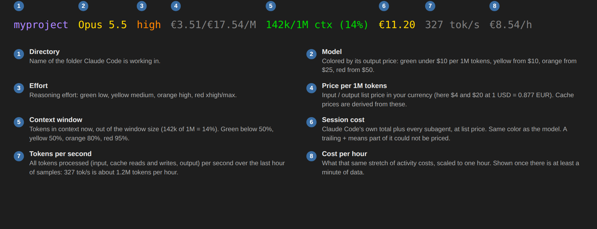
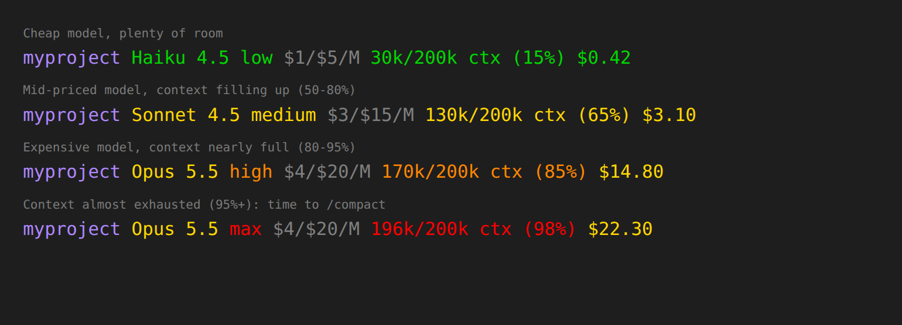
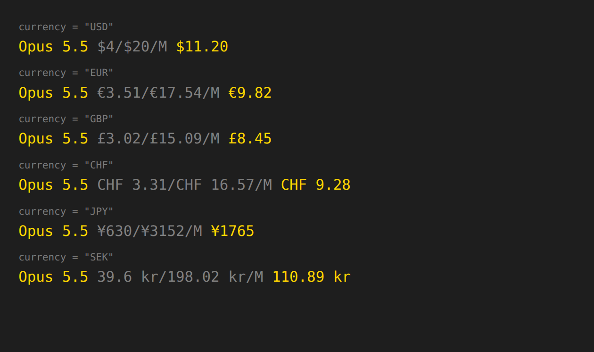
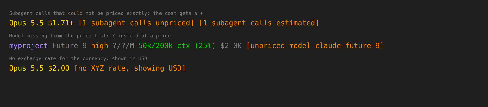

# tachobar

A fast, cross-platform status line for [Claude Code](https://code.claude.com)
that shows **what your session really costs**, in your own currency.

[](https://buymeacoffee.com/DrFritzi)


## Reading the line



| Part                 | Meaning                                                                                                                                                                                                  |
| -------------------- | -------------------------------------------------------------------------------------------------------------------------------------------------------------------------------------------------------- |
| **1** `myproject`          | Name of the current directory.                                                                                                                                                                           |
| **2** `Opus 5.5`           | The model. Its color follows its **output** price: green under $10 per 1M tokens, yellow from $10, orange from $25, red from $50 (adjustable).                                                            |
| **3** `high`               | Reasoning effort: green `low`, yellow `medium`, orange `high`, red `xhigh`/`max`.                                                                                                                        |
| **4** `€3.51/€17.54/M`     | List price per **1 million tokens**: input / output, in your currency. Cache reads and writes are priced from these (see below). `?/?/M` means the model is not in the price list yet.                    |
| **5** `142k/1M ctx (14%)`  | Tokens **currently in the context window** / the window's size, and the share used. Green below 50%, yellow from 50%, orange from 80%, red from 95%. Time to `/compact` when it turns red.                 |
| **6** `€11.20`             | **Session cost** so far at list price: Claude Code's `total_cost_usd`, which already includes all subagents. Same color as the model.                                                            |
| **7** `327 tok/s`          | Burn rate: tokens processed per second over the last hour of samples, all kinds (input, cache, output), main conversation and subagents. Cache reads dominate, so this is throughput, not output speed.             |
| **8** `€8.54/h`            | Burn rate in money: what the last hour of activity costs per hour. Shown once there is at least a minute of data.                                                                                        |
| `[…]` in orange      | A warning: unpriced model, stale prices or exchange rates, missing exchange rate.                                                                                  |

Colors show up when the terminal supports them; `NO_COLOR` turns them off.

**Colors follow the model and the context**



**Currencies use their usual symbol, placement and decimals.** Unit prices
drop trailing zeros (`$4`, not `$4.00`; `39.6 kr`).



**Nothing is silently guessed.** When something cannot be priced exactly,
the line says so:



## Why tachobar

- **Correct costs.** The session cost is Claude Code's own `total_cost_usd`,
  which already includes **subagent spend**; tachobar shows it as is.
- **Any currency.** ECB reference rates, refreshed daily. `€`, `£`, `CHF`,
  `¥`, `kr` and more, each with its usual symbol placement.
- **Honest.** An unknown model shows `?`, and stale prices or exchange rates
  get a warning in the line. Nothing is silently guessed.
- **One static binary** for Windows, macOS and Linux (x64 and arm64). No
  runtime, no `jq`. A render takes a few milliseconds.

## Install

Pick one. All of them end with tachobar set as your Claude Code status line
(it appears on the next prompt, or after restarting Claude Code).

### 1. As a Claude Code plugin (easiest)

```
/plugin marketplace add DrFritzi/tachobar
/plugin install tachobar@tachobar
/tachobar:setup EUR
```

Plugins cannot set the status line themselves, so `/tachobar:setup` downloads
the binary for your OS, writes the `statusLine` setting and sets the currency
(the argument is optional). It shows each command and asks before running it.

### 2. macOS / Linux

```sh
curl --proto '=https' --tlsv1.2 -LsSf https://github.com/DrFritzi/tachobar/releases/latest/download/tachobar-installer.sh | sh
tachobar --init --write
```

### 3. Windows (PowerShell)

Download the release zip, check it and unpack it. No script is executed, and
nothing but `tachobar.exe` is installed:

```powershell
$arch = if ($env:PROCESSOR_ARCHITECTURE -eq 'ARM64') { 'aarch64' } else { 'x86_64' }
$name = "tachobar-$arch-pc-windows-msvc.zip"
$url  = "https://github.com/DrFritzi/tachobar/releases/latest/download/$name"
$zip  = "$env:TEMP\$name"
$dir  = "$env:LOCALAPPDATA\Programs\tachobar"
Invoke-WebRequest $url -OutFile $zip -UseBasicParsing
Invoke-WebRequest "$url.sha256" -OutFile "$zip.sha256" -UseBasicParsing
$want = (Get-Content "$zip.sha256" -Raw).Split(' ')[0]
if ((Get-FileHash $zip -Algorithm SHA256).Hash -ne $want) { throw "checksum mismatch" }
Expand-Archive $zip -DestinationPath $dir -Force
& "$dir\tachobar.exe" --init --write
```

`--init --write` points Claude Code at the full path of `tachobar.exe`, so it
doesn't need to be on your `PATH`. (There is deliberately no `irm … | iex`
installer: Microsoft Defender blocks that command pattern.)

### 4. From source (any platform, needs Rust 1.85+)

```sh
cargo install --git https://github.com/DrFritzi/tachobar --locked
tachobar --init --write
```

### Check it worked

```sh
tachobar doctor
```

prints the version, config location, price and exchange-rate sources and
their age, and whether `settings.json` points at tachobar. Every release file
has build provenance you can verify with
`gh attestation verify <file> --repo DrFritzi/tachobar`, and a `.sha256`.

### What `--init` writes

`tachobar --init` prints the snippet; `--init --write` adds it to
`~/.claude/settings.json`, keeps every other setting and its formatting, and
saves the old file as `settings.json.bak`:

```json
{
  "statusLine": {
    "type": "command",
    "command": "/home/you/.cargo/bin/tachobar",
    "padding": 0
  }
}
```

### Update and uninstall

- **Update:** run the same install command again. tachobar never updates
  itself.
- **Uninstall:** delete the binary, remove the `statusLine` entry from
  `settings.json` (or restore `settings.json.bak`), and delete the config and
  cache folders that `tachobar doctor` lists.

## Configuration

Run `tachobar config --write` to create the config file with every option
commented (a simple TOML subset: `key = value`, strings, numbers, booleans,
arrays and `[thresholds]`; anything else is reported with its line number), and `tachobar doctor` to see where it lives:

| OS      | Config file                                          |
| ------- | ---------------------------------------------------- |
| Linux   | `~/.config/tachobar/config.toml`                     |
| macOS   | `~/Library/Application Support/tachobar/config.toml` |
| Windows | `%APPDATA%\tachobar\config.toml`                     |

```toml
currency = "EUR"                 # any ISO 4217 code with an ECB rate, default "USD"

# Formatting overrides (defaults depend on the currency)
# decimals = 2
# symbol = "€"
# symbol_position = "after"      # "before" or "after"
# decimal_separator = ","

# Which segments to show, in order
segments = ["dir", "model", "effort", "price", "context", "cost", "burn"]

no_color = false                 # NO_COLOR in the environment also works
auto_refresh = true              # daily background download of prices and rates

[thresholds]
price_per_mtok = [10.0, 25.0, 50.0]  # output USD/1M where the model turns yellow/orange/red
context_pct = [50.0, 80.0, 95.0]     # context % where it turns yellow/orange/red
stale_days = 7                       # warn when prices or rates are older than this
```

| Segment   | Shows                                                                                          |
| --------- | ---------------------------------------------------------------------------------------------- |
| `dir`     | Name of the current directory                                                                  |
| `model`   | Model display name, colored by its output price                                                |
| `effort`  | Reasoning effort, from Claude Code, then `CLAUDE_EFFORT_LEVEL`, then `effortLevel` in settings |
| `price`   | Input/output list price per 1M tokens                                                          |
| `context` | Tokens in context / window size, and the percentage                                            |
| `cost`    | Claude Code's `total_cost_usd`, which already includes subagents          |
| `burn`    | Tokens per second and cost per hour over the last hour (needs at least a minute of data)       |

Warnings appear in brackets at the end, e.g. `[unpriced model claude-x]`,
`[prices 12d old]`, `[no XYZ rate, showing USD]`.

### Commands

```
tachobar                  render (reads Claude Code's JSON on stdin)
tachobar --init [--write] print / install the statusLine setting
tachobar config [--write] print / create the config file
tachobar refresh          download prices and exchange rates now
tachobar doctor           show data sources, their age and file locations
```

Environment: `NO_COLOR`, `COLUMNS` (set by Claude Code, used for wrapping),
`TACHOBAR_CONFIG`, `TACHOBAR_CACHE_DIR`, `TACHOBAR_STATE_DIR`,
`TACHOBAR_NO_REFRESH`.

## How costs are calculated

**Session cost = Claude Code's `cost.total_cost_usd`, as sent on the status
line.** That figure already includes subagent (Task tool) spend, so tachobar
shows it as is and adds nothing. Claude Code computes it at list price (or
from your `modelPricing` setting). Subagent transcripts are read only for
token counts, for the burn rate.

The formula below is the per-response pricing used to check the figure
against transcripts.

1. **Per response,** in USD per token from litellm's
   [`model_prices_and_context_window.json`](https://github.com/BerriAI/litellm/blob/main/model_prices_and_context_window.json):

   ```
     input_tokens                 × input_cost_per_token
   + output_tokens                × output_cost_per_token
   + cache_creation.ephemeral_5m  × cache_creation_input_token_cost
   + cache_creation.ephemeral_1h  × cache_creation_input_token_cost_above_1hr
   + cache_read_input_tokens      × cache_read_input_token_cost
   + web_search_requests          × search_context_cost_per_query
   ```

   If a request's prompt (input + cache reads + cache writes) is over 200k
   tokens and the model has `*_above_200k_tokens` prices, those rates apply to
   the whole request. If litellm lacks a cache price for a model, tachobar
   uses Anthropic's published multipliers (1.25× input for 5-minute writes,
   2× for 1-hour writes, 0.1× for reads).
4. **Request modifiers**, read from each response's `usage`:
   - **Fast mode** (`speed: "fast"`): the model's fast-mode input/output
     prices from Anthropic's [pricing page](https://platform.claude.com/docs/en/about-claude/pricing#fast-mode-pricing)
     (litellm does not carry them). Cache writes and reads scale with the
     fast input price, and fast mode has one price across the whole context
     window.
   - **US-only inference** (`inference_geo: "us"`): the data residency
     multiplier (currently 1.1×) on every token category.
   - **Batch** (`service_tier: "batch"`): 50% off every token category.

   Fast-mode prices and the data residency multiplier are re-read from the
   pricing page on each daily refresh. The parser is strict: if the page
   layout changes, the last good values stay in use, and `tachobar refresh`
   says so.
5. **Deduplication.** Claude Code writes one transcript line per content
   block (thinking, text, tool call), and each line repeats the same usage.
   Lines are deduplicated by `message.id` + `requestId`, so each API response
   is counted once.
6. **Caching.** A finished subagent transcript never changes, so its token
   count is cached by file size and modification time and parsed only once.
7. **Currency.** USD amounts are converted with the latest ECB reference
   rate from [frankfurter.app](https://frankfurter.app).

**Validation.** On a real session, the formula reproduces Claude Code's own
`costUSD` exactly: 8 input + 682 output + 231,276 cache-read +
22,241 one-hour cache-write tokens on Opus 5.5 = $0.2378552. Pricing those
1-hour writes at the 5-minute rate would give $0.171, which is 28% too low.

### Limits

- It is an **estimate at list price**, not your invoice. Negotiated
  discounts and subscription plans (Pro/Max) are not reflected. On a
  subscription, the number is what the usage *would* cost at API prices.
- A model litellm does not know shows `?` for its price.
- Exchange rates are ECB daily reference rates, not your card's rate.
- The tokens/s figure counts all tokens processed (input, cache reads and
  writes, output) by the main conversation and subagents.

## Data and privacy

tachobar reads transcripts only for token counts and model ids. Its only
network traffic is a daily set of HTTPS GETs: GitHub (litellm pricing),
platform.claude.com (Anthropic's pricing page, for fast-mode and data residency
prices) and frankfurter.app (exchange rates). A background process makes them
with a small built-in HTTPS client (rustls, TLS 1.2+), so it never delays
rendering and needs no `curl`. It honours `HTTPS_PROXY` / `NO_PROXY`.
Certificates are checked against a bundled Mozilla root list; behind a
TLS-inspecting proxy, point `SSL_CERT_FILE` at your CA bundle (PEM).
All data ships bundled in the binary, so tachobar works offline from the first
run. There is no telemetry. See [SECURITY.md](SECURITY.md).

## Support

If tachobar saves you money or just a little guesswork, you can
[buy me a coffee](https://buymeacoffee.com/DrFritzi). ☕

## License

[MIT](LICENSE) © DrFritzi. Third-party notices for the bundled crates are in
[THIRD-PARTY-LICENSES.md](THIRD-PARTY-LICENSES.md) and in every release archive.
